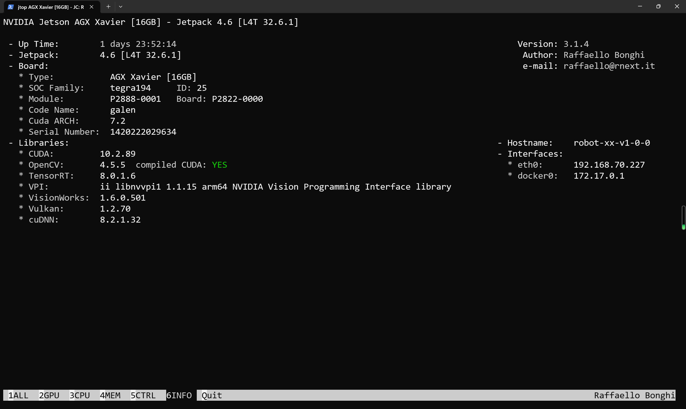
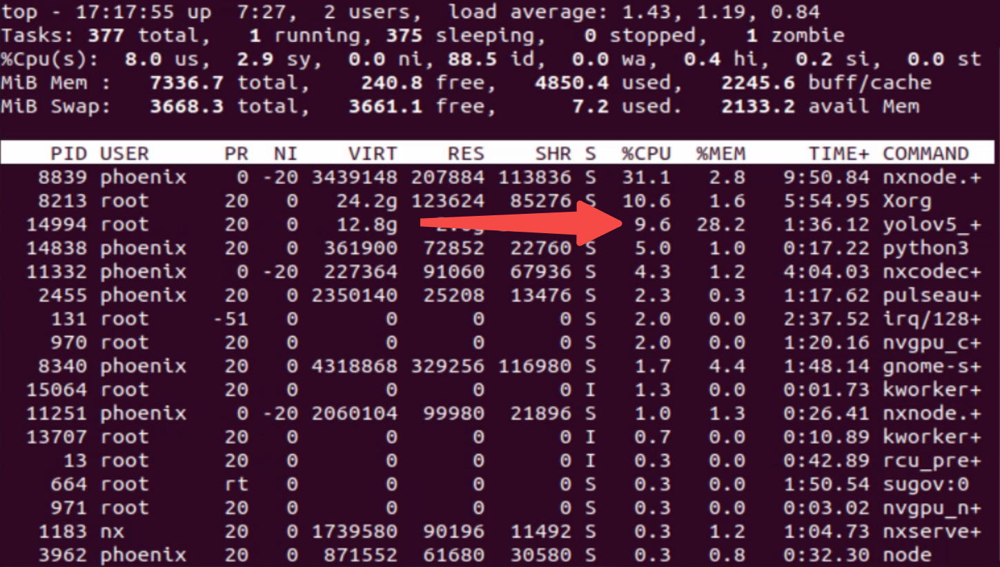
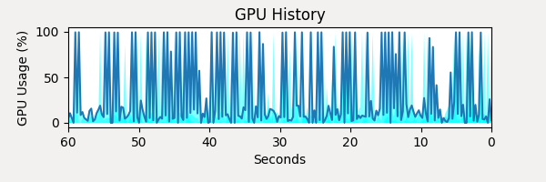

[Device INFO](#Some-infomation-about-device)

[Usage](#How-to-use)

[Consumption](#The-consumption-of-resources-while-the-program-is-running(8-video-streams))

## Some infomation about device😄

- <font color="red">NVIDIA Jetson Orin Nano 8GB</font>



## How to use😮

```shell
:~/autodl-tmp/yolov5# python3 val.py --weights runs/train/exp5/weights/b
est.pt --data ../DATA/data.yaml --img 640
val: data=../DATA/data.yaml, weights=['runs/train/exp5/weights/best.pt'], batch_size=32, imgsz=640, conf_thres=0.001, iou_thres=0.6, max_det=300, task=val, device=, workers=8, single_cls=False, augment=False, verbose=False, save_txt=False, save_hybrid=False, save_conf=False, save_json=False, project=runs/val, name=exp, exist_ok=False, half=False, dnn=False

YOLOv5 🚀 v7.0-135-g9dd0ad3 Python-3.8.10 torch-1.8.1+cu111 CUDA:0 (NVIDIA A40, 48688MiB)

Fusing layers...
YOLOv5l summary: 267 layers, 46172898 parameters, 0 gradients, 107.8 GFLOPs
				Class     Images  Instances          P          R      mAP50   mAP50-95
                   all       4000      18965      0.846      0.715      0.779      0.584
                Worker       4000      11658      0.888      0.788      0.859       0.59
          Static crane       4000        972      0.822      0.722      0.789      0.582
          Hanging head       4000        307      0.816      0.619      0.676      0.364
                 Crane       4000        362      0.791      0.655      0.721      0.542
                Roller       4000        171      0.893      0.778      0.872      0.756
             Bulldozer       4000        205      0.874        0.8      0.845      0.674
             Excavator       4000       2622      0.934      0.876      0.924      0.766
                 Truck       4000       1094      0.842      0.646      0.737      0.558
                Loader       4000        170      0.837      0.724      0.754      0.587
            Pump truck       4000        241      0.898      0.804      0.869      0.671
        Concrete mixer       4000        179      0.812      0.772      0.792      0.659
          Pile driving       4000        160      0.825      0.589      0.686      0.441
         Other vehicle       4000        824      0.764      0.519      0.597      0.409
Speed: 0.1ms pre-process, 6.4ms inference, 1.1ms NMS per image at shape (32, 3, 640, 640)
Results saved to runs/val/exp


mkdir build
cd build
cmake ..
make 

#run 8 video streams
sudo ./yolov5_det ../weights/best.engine 

cap.read time: 15ms
Preprocess time: 14ms
inference time: 98ms
NMS time: 0ms
Draw bounding boxes time: 0ms
cap.read time: 3ms
cap.read time: 4ms
cap.read time: 8ms
cap.read time: 12ms
cap.read time: 14ms
cap.read time: 18ms
cap.read time: 3ms
cap.read time: 11ms
Preprocess time: 12ms
inference time: 93ms
NMS time: 0ms
Draw bounding boxes time: 0ms
cap.read time: 8ms
cap.read time: 12ms
cap.read time: 17ms
cap.read time: 14ms
cap.read time: 18ms
cap.read time: 19ms
cap.read time: 8ms
cap.read time: 19ms
Preprocess time: 11ms
inference time: 92ms
NMS time: 0ms
Draw bounding boxes time: 0ms
```


## The consumption of resources while the program is running(8 video streams)🚀



